> 在这个人心浮躁的社会，用文字来沟通往往不尽人意，所以现在我们更喜欢用表情包生动形象表达我们此时此刻的言语

> 但是表情包在通过日积月累，会越来越多，这时找起表情包十分的麻烦，这时你需要这款经过整理的表情包

## B数

## 搬砖

## 背锅

## 操作

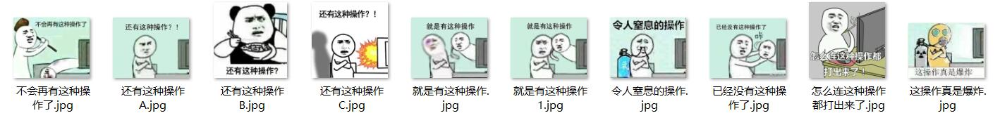

## 撤回

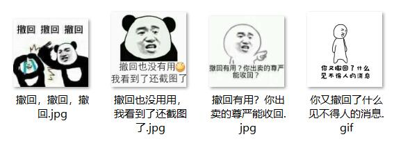

##  猝死

##  大佬

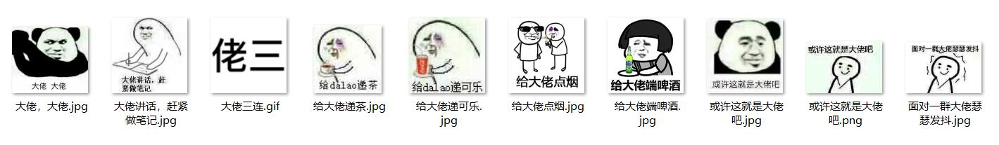

##  干架

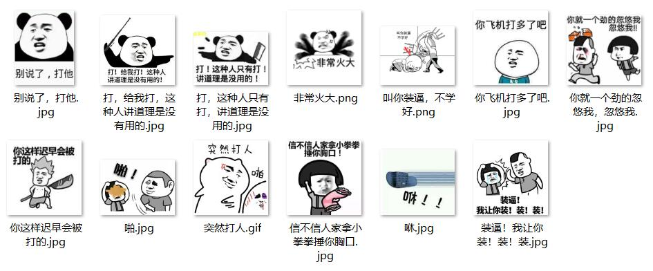

##  红包

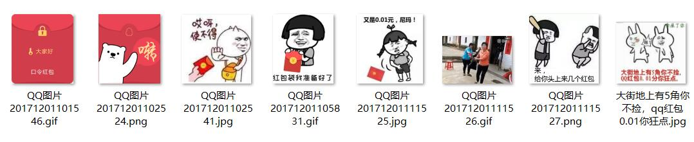

## 老司机

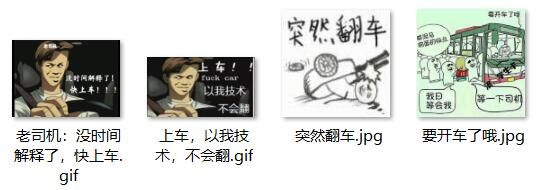

## 伤心

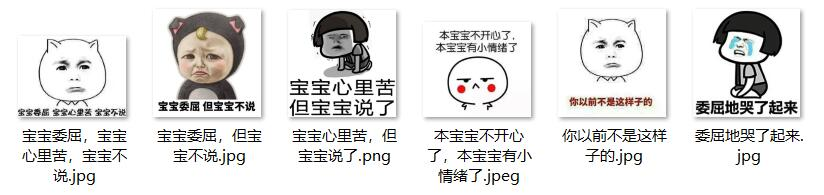

## 套图

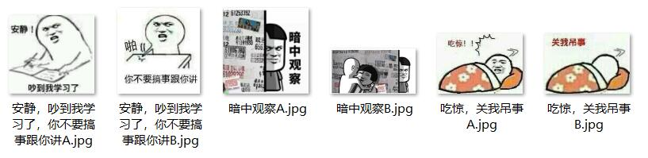

## 咸鱼

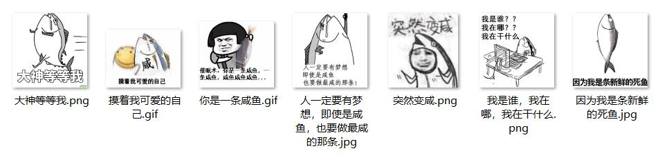

## 新人

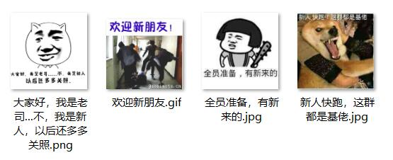

## 文字

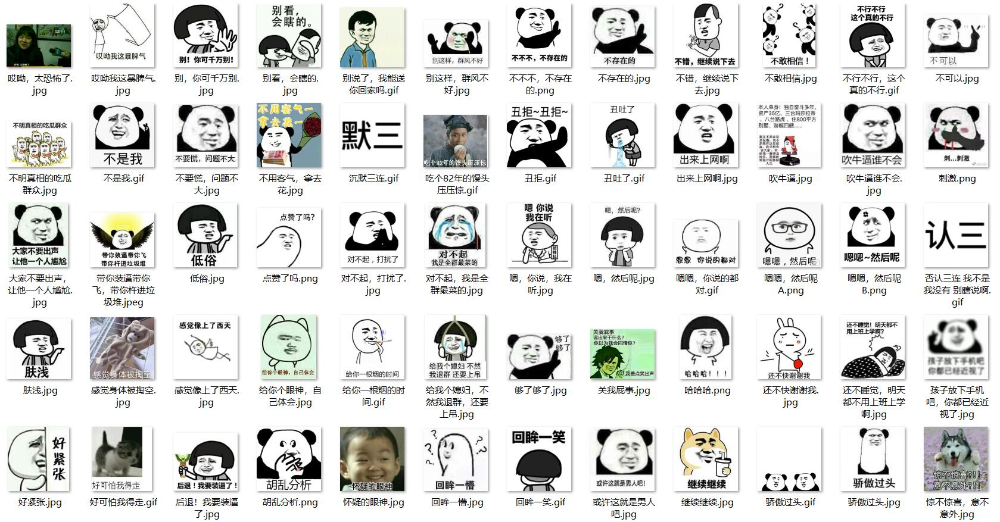

## 表情

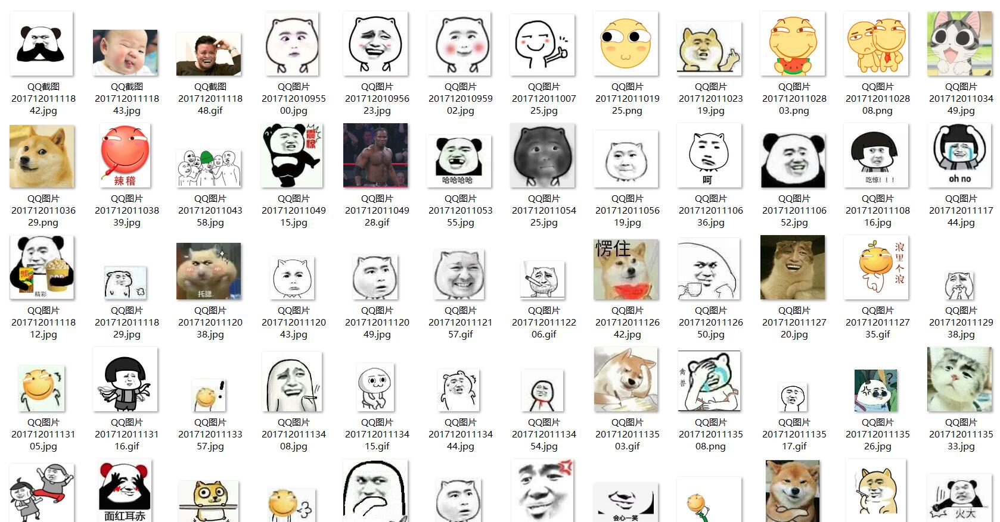

## 程序员

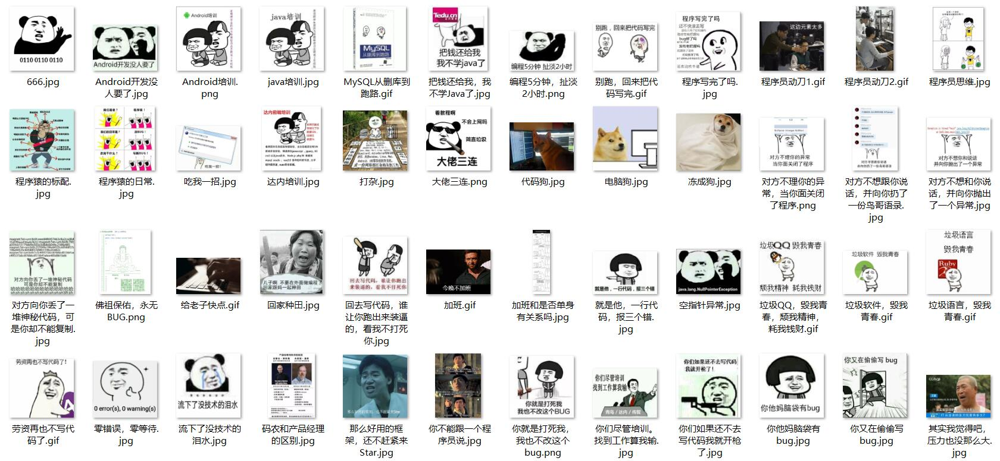

## 夸奖

#### 将近上千个表情包，如果查找需要的表情包，可直接搜索关键字

#### 强烈建议将此项目作为Git版本管理项目，享受永久更新

#### 如果你有好的表情包资源，请直接通过 Pull 请求提交给我